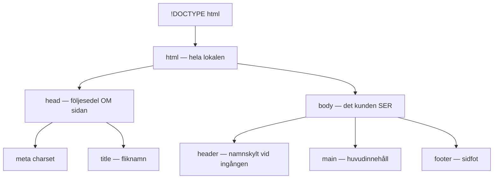
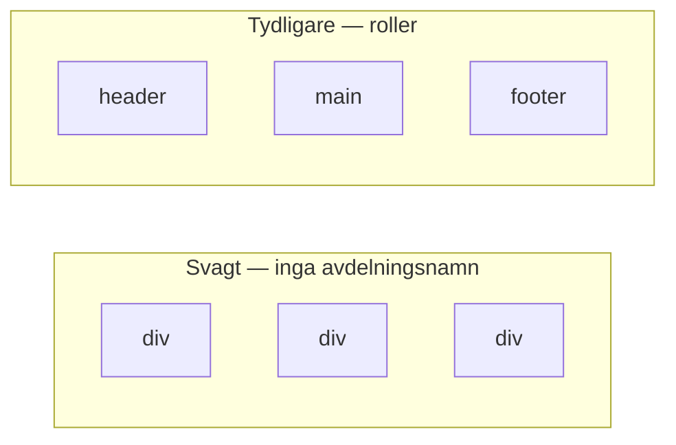
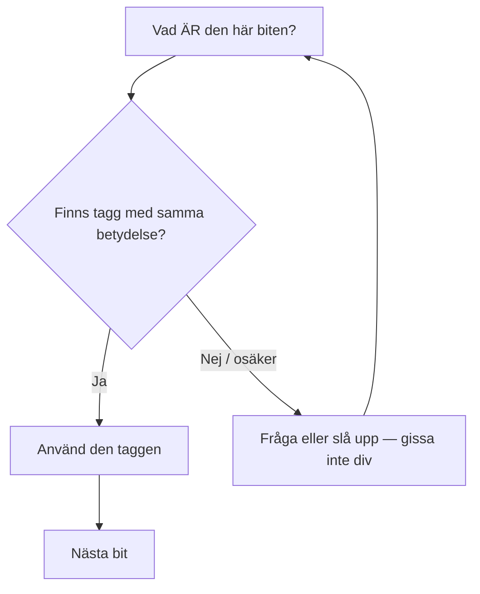

# 02 — Visuellt: dokumentets karta

Samma butiksmetafor som i teoriguiden — nu som bild. Ingen design-guide den här veckan: struktur räcker att se som träd.

GitHub renderar diagrammen nedan automatiskt.

---

## Dokumentträd — grundplan och avdelningar

**Vad diagrammet visar:** Var metadata respektive synligt innehåll bor.  
**Varför det hjälper:** Du ser att `head` och `header` ligger på olika ställen.  
**Kom ihåg / INTE:** `head` ≠ `header`. Head är följesedeln. Header är namnskylten i body.

---

## Betydelse vs generisk kartong — problemet som bild

Till vänster: tre kartonger utan betydelse — sidan *kan* synas, men koden säger inget.  
Till höger: tre roller du (och verktyg) kan läsa. Det är semantik i en bild.

**Målsvar (säg högt / skriv i README):** *“Semantiska taggar bär betydelse; div är bara en låda utan lapp.”*

---

## Metod som flöde

När du tvekar — följ pilarna. Det är inte magi; det är intervjun.

**Om du hoppar till “låda”:** risken är `div` överallt. Gå tillbaka till “Vad *är* det?”.

---

## Checkpoint (privat)

Utan att titta på teoriguiden: rita (eller skriv) skillnaden `head` vs `header` i en mening. Jämför sen med diagrammet ovan.

När kartan sitter: [03 — Övningar](./03-ovningar.md).
