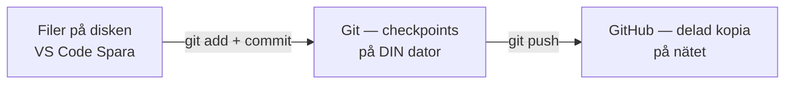
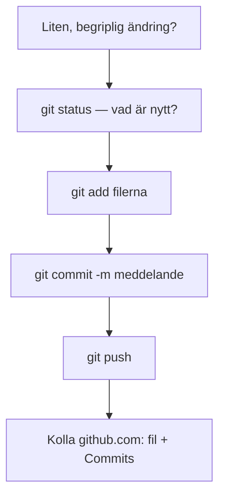
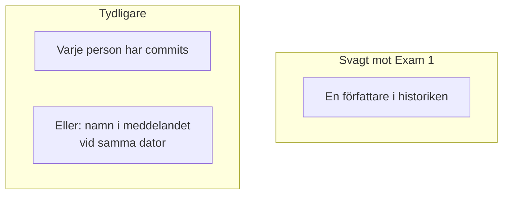

# 02 — Visuellt: Git-kedjan

Samma checkpoint-metafor som i teoriguiden — nu som flöde. Ingen branch-karta i det här paketet: tre steg + push räcker att se.

GitHub renderar diagrammen nedan automatiskt.

---

## Var sakerna bor

**Vad diagrammet visar:** Spara i editorn stannar till vänster. Historiken sitter i mitten. Examinationen tittar till höger.  
**Kom ihåg / INTE:** Git ≠ GitHub. Utan push syns inget på github.com.

---

## Kedjan när du har en ändring

**Om du hoppar till push direkt:** ofta inget att skicka, eller fel filer. Gå tillbaka till status → add → commit.

**Målsvar (säg högt / skriv i README):** *“Add väljer, commit sparar ögonblicksbilden, push skickar den till GitHub.”*

---

## Synlig medverkan som bild

Till vänster: det *kan* finnas massor av kod — men historiken ljuger om gruppen.  
Till höger: det går att *peka* på vem som jobbat.

---

## Checkpoint (privat)

Utan att titta på teoriguiden: säg kedjan högt (status → add → commit → push) och var Exam 1 tittar. Jämför sen med diagrammen.

När kartan sitter: [03 — Övningar](./03-ovningar.md).
