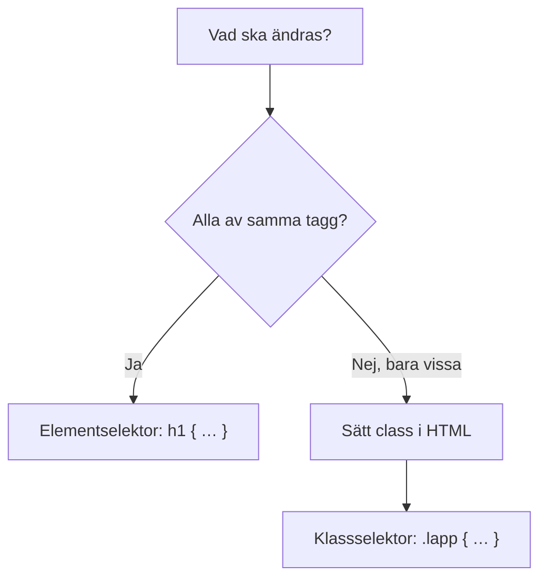
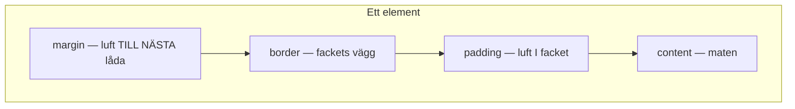
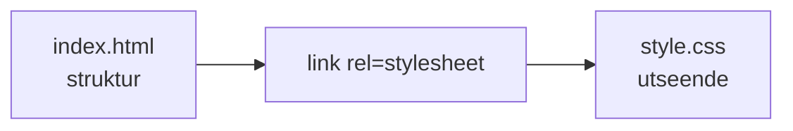

# 02 — Visuellt: selektorer och matlådan

Samma matlåda-metafor som i teoriguiden — nu som bild. Ingen Flex/Grid-karta: lager + “vem träffas?” räcker.

GitHub renderar diagrammen nedan automatiskt.

---

## Vem stylas?



**Kom ihåg / INTE:** Prick i CSS, ingen prick i `class="…"`. Att ge class utan regel = ingen synlig effekt.

**Målsvar (säg högt / skriv i README):** *“Alla av en tagg → element. Bara vissa → class och .klassnamn.”*

---

## Matlådan — inifrån och ut



(Läs den som lager runt maten: ytterst margin, sedan border, sedan padding, innerst content.)

**Vad diagrammet visar:** Inuti och utanför är olika rattar.  
**Varför det hjälper:** “Text kuddra mot kanten” är padding-problemet. “Två block kuddra mot varandra” är margin-problemet.

```text
+---------------------------+
|         margin            |
|   +-------------------+   |
|   |      border       |   |
|   |  +-------------+  |   |
|   |  |   padding   |  |   |
|   |  |  +-------+  |  |   |
|   |  |  |content|  |  |   |
|   |  |  +-------+  |  |   |
|   |  +-------------+  |   |
|   +-------------------+   |
+---------------------------+
```

---

## Två filer



Utan `link` (eller med fel `href`) händer inget i webbläsaren — CSS-filen kan vara hur rätt som helst.

---

## Checkpoint (privat)

Utan att titta: rita matlådan med fyra ord. Säg när du tar padding vs margin. Jämför sen.

När kartan sitter: [03 — Övningar](./03-ovningar.md).
