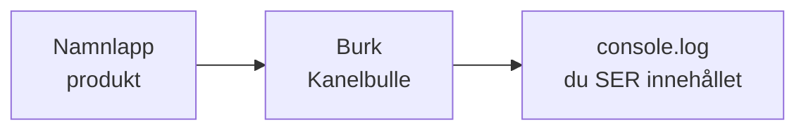
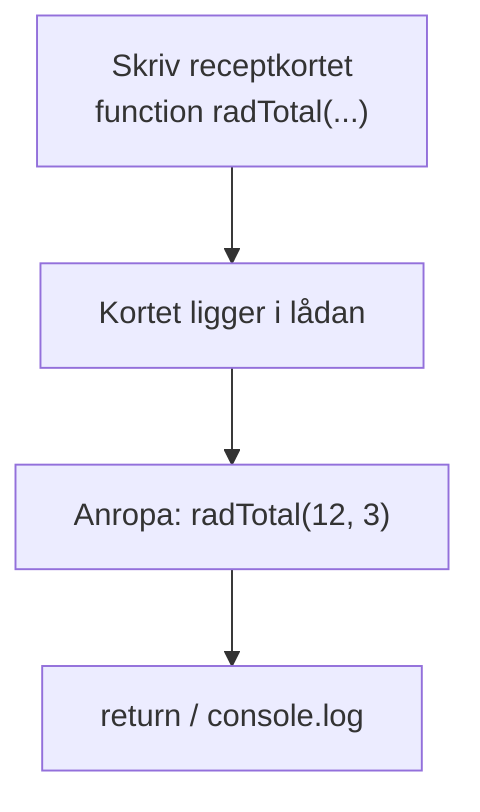
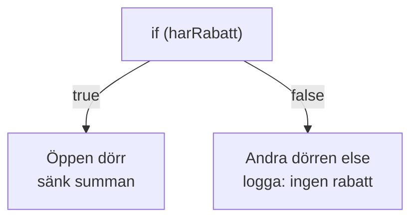
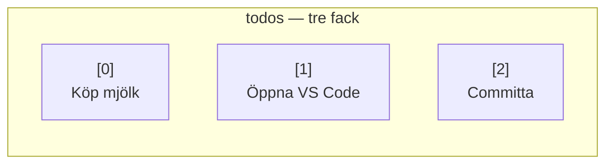
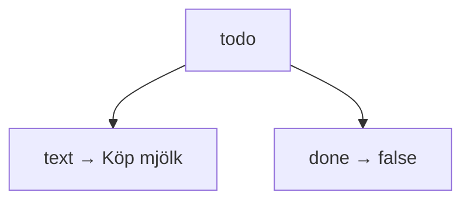
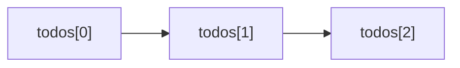
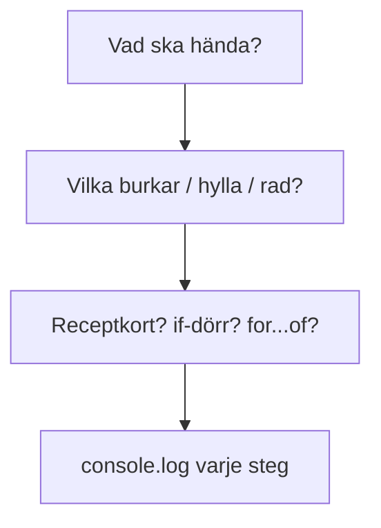

# 02 — Visuellt: burkar, dörr, hylla

Samma bilder som i teoriguiden — nu som flöde. Ingen React, ingen DOM, inga array-metoder. GitHub renderar diagrammen automatiskt.

---

## Värdet måste ligga någonstans



**Vad diagrammet visar:** Lappen är namnet. Burken är värdet. Loggen är beviset.  
**Kom ihåg / INTE:** `console.log` är inte sidans synliga text.

---

## Receptkortet måste anropas



Utan C: inget resultat. Kortet är inte magi.

**Målsvar (säg högt / skriv i README):** *“Deklarera = skriva receptkortet. Anropa = laga med namn().”*

---

## Dörren — vägvalet

Boolean i burken räcker inte. Koden måste *fråga*.



**Vad diagrammet visar:** En fråga, två vägar. `else` är inte en extra fråga — det är den stängda dörren.  
**Kom ihåg / INTE:** Utan `if` är `true` bara en lapp. `===` frågar värde och typ. `==` gissar.

**Målsvar (säg högt / skriv i README):** *“if öppnar en dörr när svaret är true. else är den andra vägen.”*

---

## Hyllan — numrerad lista



Första facket heter **0**. `.length` är **3** (antal), inte 2.

**Vad diagrammet visar:** En array är en hylla med nummer.  
**Kom ihåg / INTE:** `[1]` är andra saken. Array-metoder hör inte hit — du pekar med index.

**Målsvar (säg högt / skriv i README):** *“Array = hylla. Index från 0. .length = hur många som står där.”*

---

## Etikettlådan — ett objekt

Hyllan är många saker. Kortet är *en* rad med namngivna lappar.



Du läser med punkt: `todo.text`, `todo.done`.

**Vad diagrammet visar:** Nyckel till vänster, värde till höger — samma låda.  
**Kom ihåg / INTE:** Det är inte en array. Ingen `[0]` på fälten. Punktnotation, inte gissa nyckelnamnet.

**Målsvar (säg högt / skriv i README):** *“Objekt = en rad med namn. Jag läser todo.text.”*

---

## Rullbandet — for...of

Samma hylla. En sak i taget. Du tittar, loggar, går vidare.



```javascript
for (const rad of todos) {
  console.log(rad);
}
```

**Vad diagrammet visar:** Rundgång längs hyllan — inte tre handskrivna loggar.  
**Kom ihåg / INTE:** `for...of` *läser*. Senare finns sätt att gå igenom listan som *bygger en ny lista*. Först äger du stegen.

**Målsvar (säg högt / skriv i README):** *“for...of går fack för fack. En sak i taget.”*

---

## Metod när något ska räknas



---

## Checkpoint (privat)

Säg högt: burk, tre typer, `const`/`let`, receptkort + anrop, dörren (`if`/`===`), hyllan (`[0]` / `.length`), etikettlådan (`todo.text`), rullbandet (`for...of`), var loggen syns. Jämför sen med diagrammen.

När kartan sitter: [03 — Övningar](./03-ovningar.md).
