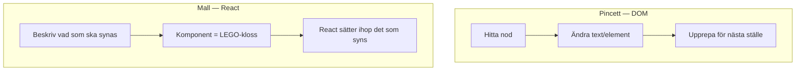
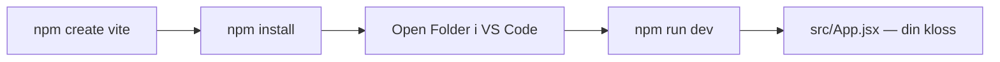

# 02 — Visuellt: pincett vs LEGO-kartong

Samma bilder som i teoriguiden — nu som flöde. Ingen `useState`. GitHub renderar diagrammen automatiskt.

---

## Två sätt att röra UI

**Kom ihåg / INTE:** Pincett är inte “fel”. Den skalar dåligt när samma data ska synas många gånger.

---

## Kartongen (Vite) → klossen du redigerar

`main.jsx` tänder lampan. `App.jsx` är klossen du börjar skruva i.

**Målsvar (säg högt / skriv i README):** *“Vite skapar kartongen. App.jsx är LEGO-klossen jag redigerar först.”*

---

## Checkpoint (privat)

Säg högt: pincett vs mall, komponent = kloss, create → install → Open Folder → dev. Jämför sen med diagrammen.

När kartan sitter: [03 — Övningar](./03-ovningar.md).
