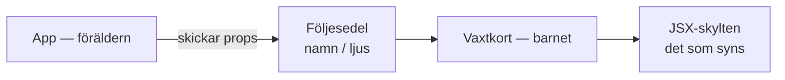
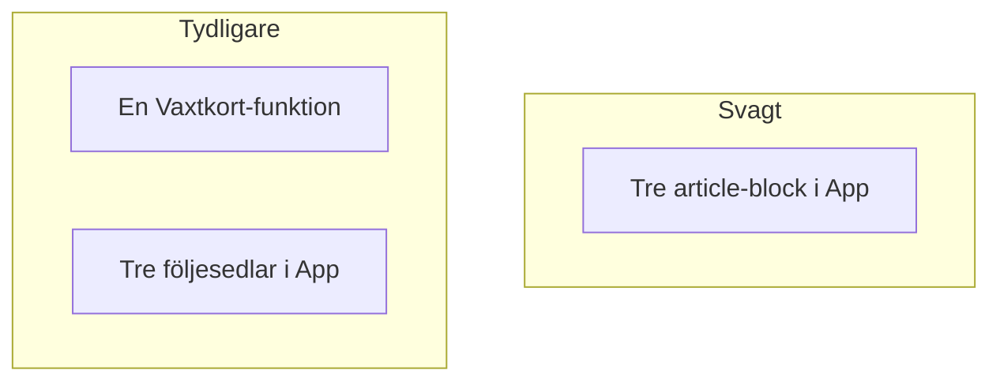

# 02 — Visuellt: skylt och följesedel

Samma bilder som i teoriguiden — nu som flöde. Ingen `useState`. GitHub renderar diagrammen automatiskt.

---

## Vem skriver sedeln, vem läser den?

**Kom ihåg / INTE:** Barnet hittar inte på “Basilika” själv om du vill återanvända klossen. Sedeln kommer utifrån.

---

## Copy-paste vs en kloss

Till vänster: tre ställen att laga skylten. Till höger: en skylt, tre namnbrickor.

**Målsvar (säg högt / skriv i README):** *“Föräldern skickar props. Barnet läser dem i JSX med klamrar.”*

---

## Checkpoint (privat)

Säg kedjan högt: kloss → skylt (JSX) → följesedel (props). Jämför sen med diagrammen.

När kartan sitter: [03 — Övningar](./03-ovningar.md).
