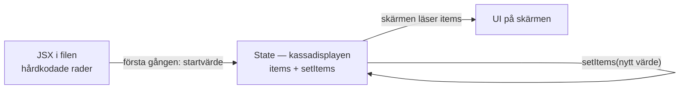
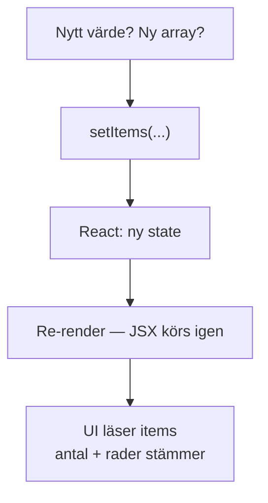
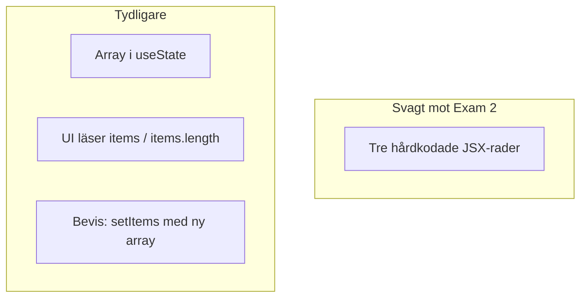

# 02 — Visuellt: state → UI

Samma kassadisplay som i teoriguiden — nu som flöde. Ingen karta över input-fält eller `.map()`: state byts → JSX körs om → skärmen följer.

GitHub renderar diagrammen nedan automatiskt.

---

## Var sakerna bor

**Vad diagrammet visar:** Hårdkodade rader stannar i filen tills du flyttar dem till displayen. Efter det är det `items` skärmen ska titta på.  
**Kom ihåg / INTE:** En lapp i fickan (`let` + `push`) är inte displayen. Utan `setItems` ritas den inte om.

---

## Kedjan när state ändras

**Om du hoppar över set-funktionen:** du kanske har ändrat en array i minnet, men kassadisplayen (och kunden) ser samma sak.

**Målsvar (säg högt / skriv i README):** *“setItems ger ny state → React kör JSX igen → skärmen speglar datan.”*

---

## Problem vs display

Till vänster: det *kan* se ut som en lista — men det finns inget att uppdatera.  
Till höger: det går att *peka* på var listan bor och varför skärmen följde efter ett klick.

---

## Checkpoint (privat)

Utan att titta på teoriguiden: säg kedjan högt (set → ny state → re-render → UI) och vad som saknas om du bara gör `push`. Jämför sen med diagrammen.

När kartan sitter: [03 — Övningar](./03-ovningar.md).
