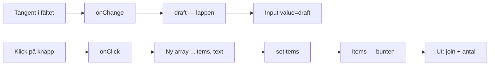
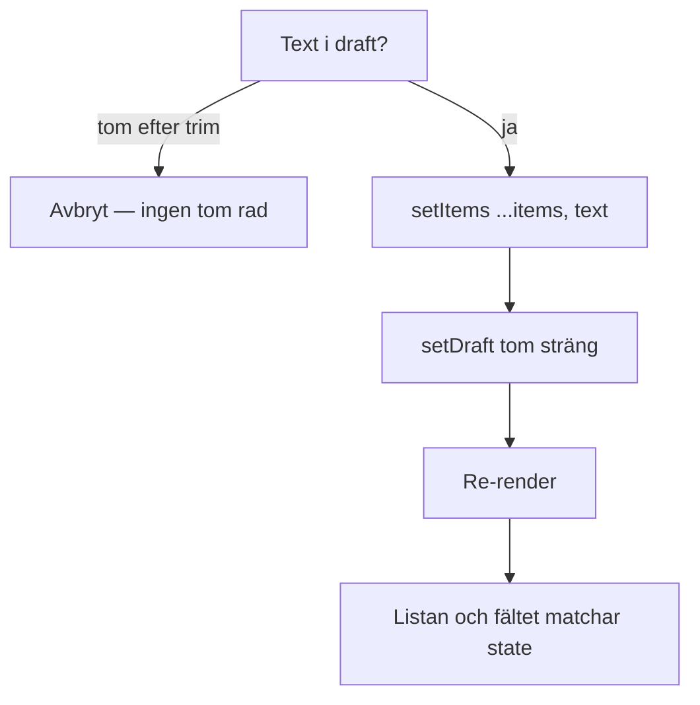
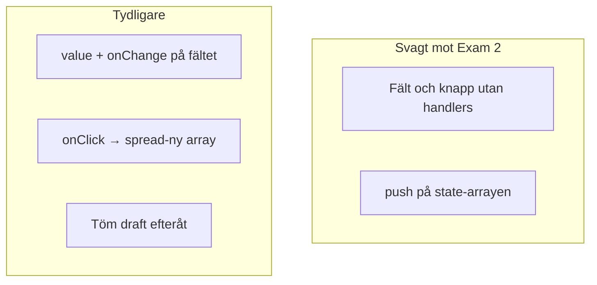

# 02 — Visuellt: event → state → UI

Samma ringklocka och postlåda som i teoriguiden — nu som flöde. Ingen ta-bort-karta: tangent synkar lappen, klick flyttar till bunten.

GitHub renderar diagrammen nedan automatiskt.

---

## Två displayytor

**Vad diagrammet visar:** Fältet och listan är olika state. Klockan (`onChange`/`onClick`) är bara kopplingen.  
**Kom ihåg / INTE:** `onChange` lägger inte till. `push` ritar inte om pålitligt.

---

## Kedjan när du lägger till

**Om du hoppar till `push`:** samma låda, luddig signal. Gå tillbaka till ny array.

**Målsvar (säg högt / skriv i README):** *“Klick läser draft, skickar en ny array till set-funktionen, tömmer fältet — sen följer UI.”*

---

## Problem vs kopplad kassa

Till vänster: det *kan* se ut som ett formulär. Till höger: det går att *peka* på vad klicket gör.

---

## Checkpoint (privat)

Utan att titta: säg kedjan högt (onChange → draft, onClick → ny array → töm). Jämför sen.

När kartan sitter: [03 — Övningar](./03-ovningar.md).
