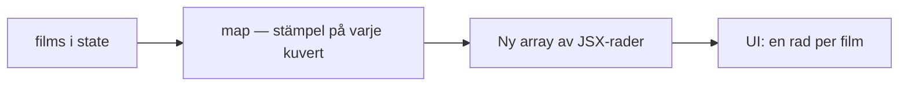
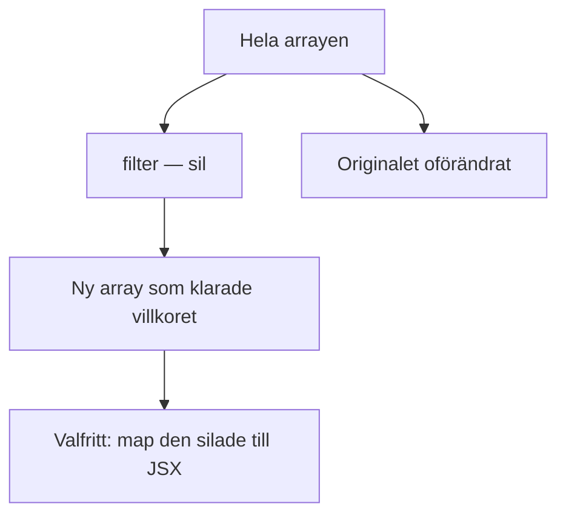
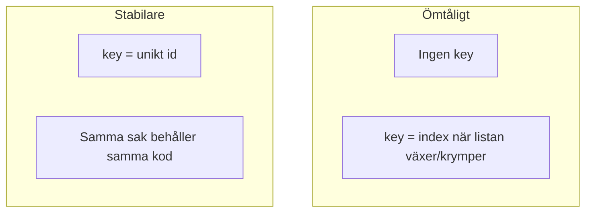

# 02 — Visuellt: map stämplar, filter silar

Samma kuvert och sil som i teoriguiden — nu som bild. Ingen karta över klar-bockar: en rad per sak, och en ny hög utan vissa.

GitHub renderar diagrammen nedan automatiskt.

---

## Från state till rader

**Vad diagrammet visar:** Skärmen läser inte tre fasta stolar. Den får en stämplad rad per element.  
**Kom ihåg / INTE:** Map tar inte bort. Utan `key` saknar kuverten streckkod.

---

## filter är en annan maskin

**Om du `splice`:ar state:** du muterar samma låda. Silen ger en ny skål.

**Målsvar (säg högt / skriv i README):** *“map omvandlar varje element (ofta till JSX). filter behåller vissa. Båda returnerar ny array.”*

---

## key när högen ändras

Till vänster: React kan blanda ihop raderna. Till höger: streckkoden följer kuvertet.

---

## Checkpoint (privat)

Utan att titta: säg map vs filter högt (stämpel vs sil) och var `key` sitter. Jämför sen.

När kartan sitter: [03 — Övningar](./03-ovningar.md).
